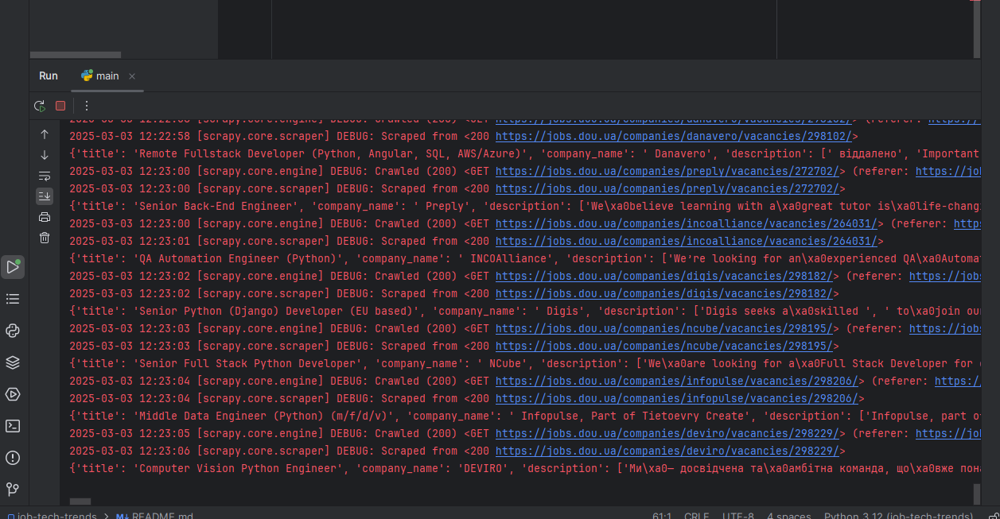
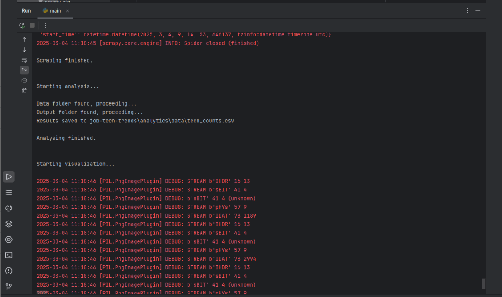
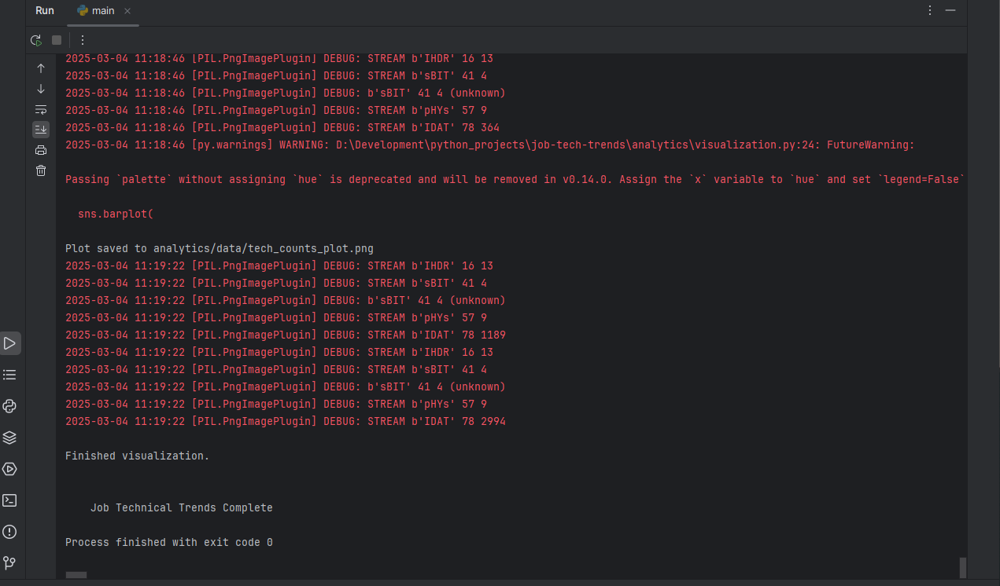
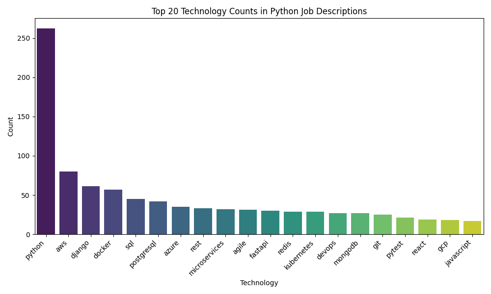

# Job Tech Trends


## Description
Analyze and visualize the most in-demand technologies in the job market.


## Technologies Used
- Python
- Scrapy
- Selenium
- Pandas
- Matplotlib


## Features
- Scrape data from job platform
- Analyze main technologies words from description
- Create visualization of most essential technologies.


## Setup
To install the project locally on your computer, execute the following commands in a terminal:
```bash
git clone https://github.com/Illya-Maznitskiy/job-tech-trends.git
cd job-tech-trends
python -m venv venv
venv\Scripts\activate (on Windows)
source venv/bin/activate (on macOS)
pip install -r requirements.txt
```


## Run the app
Open the terminal and use the following command:
(Average execution time: ~3 minutes)
```bash
python main.py
```


## Check result
- To check result open the path:
[analytics/data/tech_counts_plot.png](analytics/data/tech_counts_plot.png)


# Screenshots:

### Scraping Data


### Data Analysis 


### Visualization Saving 


### Visualization result

